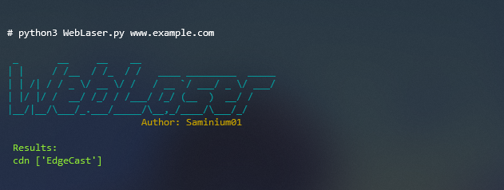

# WebLaser


This is a simple script writted with Python 3 for get some information like:

1- Web Server

2- CMS

3- Programming Language

and more...

## Usage
Just run the script; requirements will be install automatically!

If you have any problem with the automatic installation:
```
pip install -r requirements.txt
```

## Social
Follow my github
- <a href="https://github.com/saminium01">Github</a>
